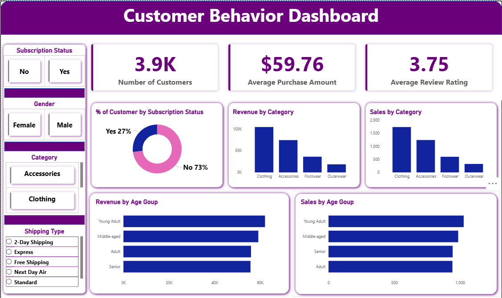

# 🛒 Customer Shopping Behavior Analysis

## 📌 Overview

An end-to-end **Data Analytics Project** focused on analyzing customer shopping behavior using **Python, SQL, and Power BI**.
This project transforms raw transactional data into meaningful business insights through **data cleaning, exploratory data analysis (EDA), SQL querying, and dashboard visualization**.

The goal is to understand customer purchasing patterns, product performance, subscription behavior, and revenue trends to support data-driven business decisions.

---

# 📂 Dataset Information

The dataset contains customer shopping transaction details such as:

* 👤 Customer Demographics
* 🛍 Product Categories
* 💰 Purchase Amounts
* 🎟 Discounts & Promo Usage
* 🚚 Shipping Methods
* ⭐ Product Ratings
* 🔁 Purchase Frequency
* 📍 Customer Locations

### Dataset Size

* **Rows:** 3900
* **Columns:** 18

---

# 🛠 Tools & Technologies Used

| Technology           | Purpose                 |
| -------------------- | ----------------------- |
| Python               | Data Cleaning & EDA     |
| Pandas & NumPy       | Data Processing         |
| Matplotlib & Seaborn | Data Visualization      |
| PostgreSQL / MySQL   | SQL Analysis            |
| Power BI             | Dashboard Creation      |
| Gamma                | Presentation Slides     |
| Jupyter Notebook     | Development Environment |

---

# 🔍 Project Workflow

## 1️⃣ Data Loading

* Imported dataset using Pandas
* Explored structure and statistics

## 2️⃣ Data Cleaning

* Handled missing values
* Removed redundant columns
* Standardized column names
* Improved data consistency

## 3️⃣ Exploratory Data Analysis (EDA)

* Customer purchase analysis
* Product trend analysis
* Discount impact analysis
* Subscription behavior analysis

## 4️⃣ SQL Business Analysis

Performed advanced SQL queries for:

* Revenue Analysis
* Customer Segmentation
* Top Products Identification
* Shipping Analysis
* Subscription Insights

## 5️⃣ Power BI Dashboard

Created an interactive dashboard to visualize:

* 📈 Revenue Trends
* 🛒 Product Performance
* 👥 Customer Segments
* 💳 Purchase Behavior
* 🚚 Shipping Insights

## 6️⃣ Reporting & Presentation

* Prepared project documentation
* Created presentation slides using Gamma

---

# 📊 Dashboard Highlights

✨ Revenue by Gender
✨ Top Purchased Products
✨ Subscription vs Non-Subscription Analysis
✨ Customer Segmentation
✨ Revenue by Age Group
✨ Shipping Type Comparison


---

# 🎯 Key Insights

* Identified high-value customers
* Analyzed customer spending patterns
* Found top-performing product categories
* Evaluated impact of discounts on sales
* Generated actionable business recommendations

---

# ▶️ How to Run the Project

## 🔹 Install Required Libraries

```bash id="slf5cu"
pip install pandas numpy matplotlib seaborn
```

## 🔹 Run Jupyter Notebook

```bash id="5wqgmv"
jupyter notebook
```

## 🔹 SQL Analysis

* Import dataset into PostgreSQL/MySQL
* Execute SQL queries for business insights

## 🔹 Open Power BI Dashboard

* Open `.pbix` file
* Refresh dataset if required

---

# 🚀 Project Outcome

This project showcases practical skills in:

* Data Cleaning
* Exploratory Data Analysis
* SQL Querying
* Business Intelligence
* Dashboard Development
* Insight Generation

It demonstrates a complete real-world data analytics workflow suitable for business decision-making and portfolio presentation.

---

# 👨‍💻 Author

**Abhinand Babu**
